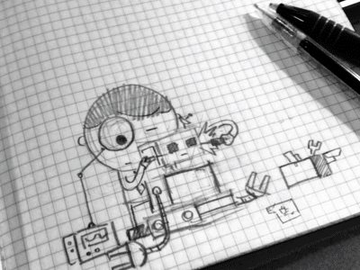

<h1 align="center">Hi 👋, I'm Utsha Kumar Roy</h1>
<h3 align="center">Passionate Robotics Enthusiast | Building a Robotic Future</h3>

  

- 🔭 I’m currently working on **Robotic Manipulation**

- 🌱 I’m currently learning **ROS2, Reinforcement Learning**

- 👯 I’m looking to collaborate on **Reinforcement learning in robotics**

- 💬 Ask me about **Robotics**

- 📫 How to reach me **utsharoy99@gmail.com**

<h3 align="left">Connect with me:</h3>

<h3 align="left">Languages and Tools:</h3>

      </a>  <a href="https://www.gnu.org/software/bash/" target="_blank" rel="noreferrer">            

&nbsp;

